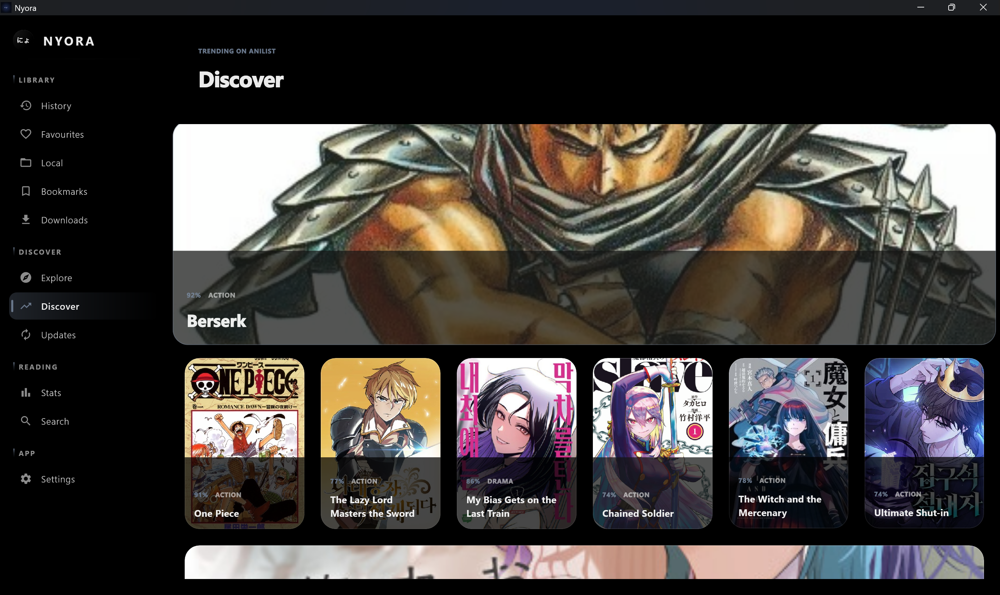
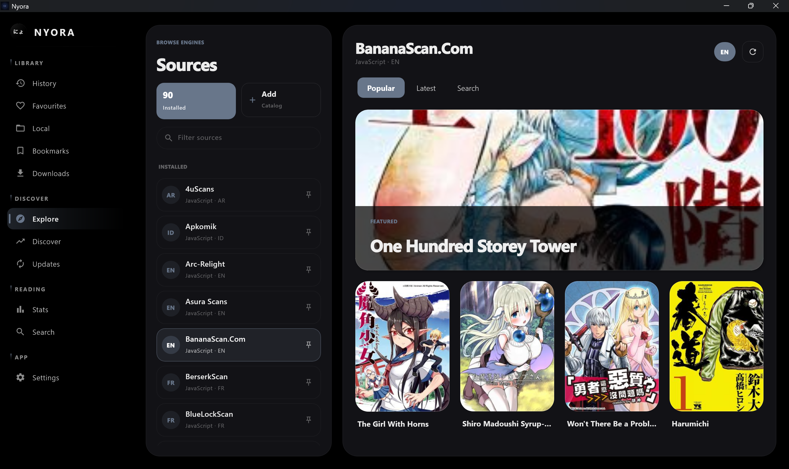
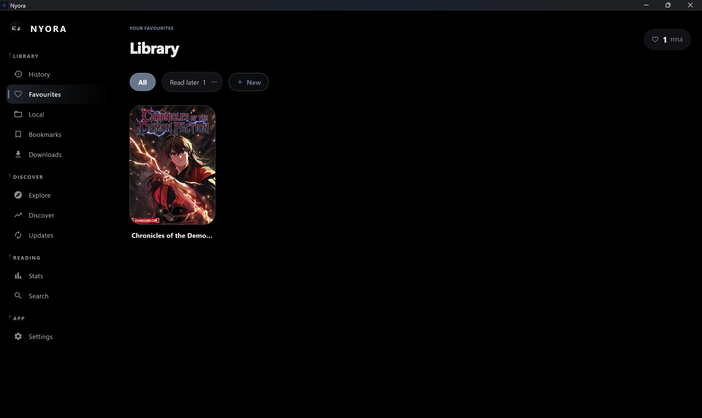
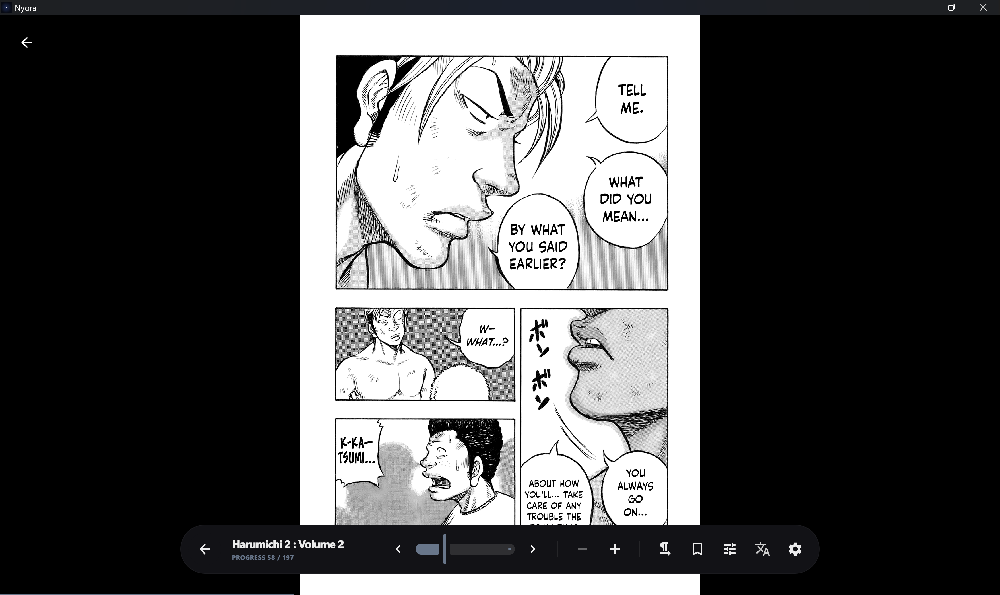
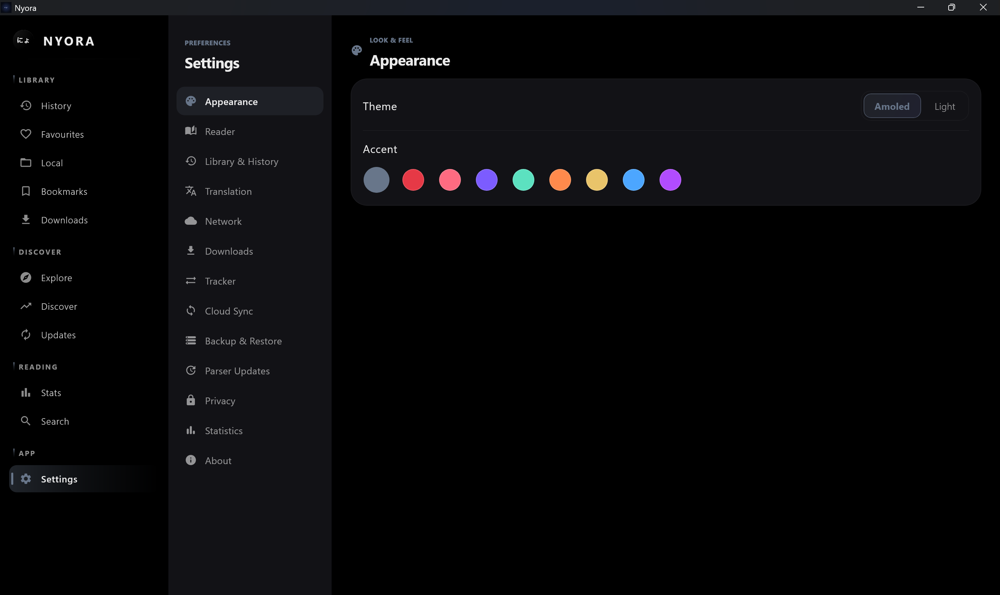
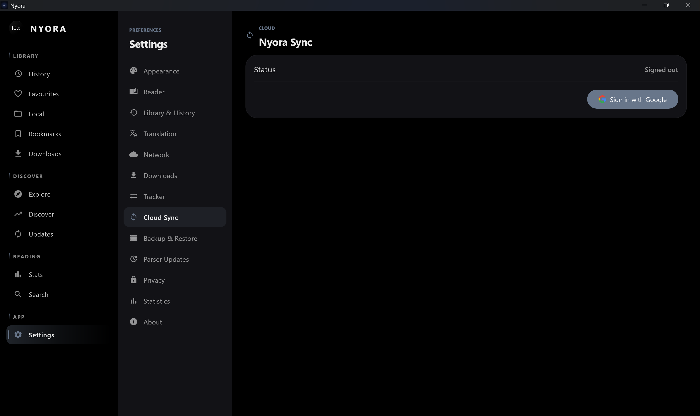

<div align="center">


# Nyora — Windows

### Read like the world can wait.

A fast, free, ad-free, open-source manga reader for Windows — built from scratch with Compose Multiplatform for Kotlin. Hundreds of online sources, whole-page AI translation, offline downloads and free cloud sync, in a self-contained installer that bundles its own Java runtime.

**No ads. No tracking. No account needed to read. Your library stays yours.**

<br/>


[](LICENSE)
[](https://github.com/Hasan72341/nyora-windows/releases/latest)
[](https://github.com/Hasan72341/nyora-windows/releases)
[](https://github.com/Hasan72341/nyora-windows/stargazers)
[](https://github.com/Hasan72341/nyora-windows/pulls)

[](https://github.com/Hasan72341/nyora-windows/releases/latest)
[](https://nyora.pages.dev)
[](https://nyoraweb.pages.dev)

**Download the `.exe`, run it, start reading — Java comes bundled, nothing else to install.**

</div>

---

| | |
|:-:|:-:|
| <br/>**Discover** — Trending titles surfaced the moment you open the app. | <br/>**Explore** — Browse every installed source from one window. |
| <br/>**Library** — Your saved manga organised into custom categories. | <br/>**Reader** — A clean, focused reader tuned for the desktop. |
| <br/>**Settings** — Reader, translation, trackers, sync and more — all in one place. | <br/>**Cloud sync** — Sign in with a free Nyora account to sync your library across every device. |

---

## About

Nyora for Windows is a native desktop manga reader built with Compose Multiplatform for Kotlin. Browse hundreds of online sources, translate untranslated pages in place with built-in Windows OCR, download chapters for offline reading, and keep your library and progress in sync across every device with free Nyora cloud sync. It ships as a self-contained installer with its own bundled Java runtime — nothing else to install — and it is completely free, ad-free, tracking-free and open-source under Apache-2.0.

## Why you'll love it

- **One download, then you're reading.** Grab the `.exe` for your architecture, run it, and you're in — the Java runtime is bundled, so there is no separate install, no setup wizard, no dependencies to chase.
- **Hundreds of sources, one library.** Manga, manhwa and manhua from a wide catalogue, all browsed and read through a single consistent interface.
- **Read anything, in any language.** Whole-page AI translation typesets a translation back over the original art using your machine's own Windows OCR — no second screen, no copy-paste.
- **Yours, offline and private.** Download chapters to local disk and read with no connection. No ads, no tracking, no account required to read — sign in only if you want free cloud sync.
- **Native to Windows 11.** A Mica backdrop, dark title bar, remembered window size and position, and an optional confirm-before-quit make it feel like it belongs on your desktop.
- **Open-source and auditable.** Apache-2.0, built in the open. You can read every line, build it yourself, and send a pull request.

## Highlights

| Pillar | What it means on Windows |
|---|---|
| Translate | Whole-page AI translation using built-in Windows OCR, typeset back over the original art. |
| Download | Save chapters to local disk and read fully offline — no connection required. |
| Sources | Browse, search and filter across hundreds of online sources for manga, manhwa and manhua. |
| Sync | Sign in with a free Nyora account (email + password) to sync your library, categories, history and exact reading progress across all platforms. |
| Open-Source | Free, ad-free, no tracking, no account required to read — Apache-2.0, built from scratch, open to PRs. |

## Table of Contents

- [About](#about)
- [Why you'll love it](#why-youll-love-it)
- [Highlights](#highlights)
- [Features](#features)
  - [Translate](#translate)
  - [Translation language packs (OCR)](#translation-language-packs-ocr)
  - [Download & Offline](#download--offline)
  - [Sources & Discovery](#sources--discovery)
  - [Cloud Sync](#cloud-sync)
  - [Reader](#reader)
  - [Trackers](#trackers)
  - [Privacy & Open Source](#privacy--open-source)
  - [Themes & Personalisation](#themes--personalisation)
- [Capability Matrix](#capability-matrix)
- [Screenshots](#screenshots)
- [Installation](#installation)
  - [Microsoft Store](#microsoft-store)
- [Build from Source](#build-from-source)
- [Tech Stack](#tech-stack)
- [Architecture](#architecture)
- [Nyora on Every Platform](#nyora-on-every-platform)
- [Roadmap](#roadmap)
- [FAQ](#faq)
- [Contributing](#contributing)
  - [Ways to contribute](#ways-to-contribute)
  - [Development setup](#development-setup)
  - [Where things live](#where-things-live)
  - [Good first contributions](#good-first-contributions)
  - [Pull request & issue etiquette](#pull-request--issue-etiquette)
- [Acknowledgements](#acknowledgements)
- [License](#license)

## Features

### Translate

Hit an untranslated chapter and Nyora reads it for you. Whole-page AI translation uses the operating system's built-in **Windows OCR** to detect every block of text on a page, translates it, and **typesets the translation back over the original artwork** in place. You stay on the page — no copy-pasting into a separate translator, no second screen, no losing the art behind a wall of subtitles.

Because OCR is provided by Windows itself, recognition runs **locally on your machine** without bundling a heavyweight model into the app — which keeps the installer lean and your pages off third-party OCR servers. The system text-recognition packs Windows installs for your language pick determine which scripts are detected best, so accuracy tracks the languages your Windows install already supports.

### Translation language packs (OCR)

Nyora's translate pipeline uses the **system `Windows.Media.Ocr` engine**, so detecting a given script requires the matching **per-language OCR pack** to be installed in Windows. If a language you want to translate isn't recognised, install its OCR pack and Nyora will pick it up.

The authoritative way to add an OCR language pack is from an **elevated PowerShell** (Run as administrator):

```powershell
# List OCR language packs available / installed
Get-WindowsCapability -Online | Where-Object Name -Like 'Language.OCR*'

# Install an OCR language pack (examples: Japanese, Korean, Simplified Chinese)
Add-WindowsCapability -Online -Name 'Language.OCR~~~ja-JP~0.0.1.0'
Add-WindowsCapability -Online -Name 'Language.OCR~~~ko-KR~0.0.1.0'
Add-WindowsCapability -Online -Name 'Language.OCR~~~zh-Hans-CN~0.0.1.0'
```

**GUI alternative:** Settings → Time & language → Language & region → (add or select the language) → Language options → Optional features → add **"Optical character recognition"**.

After installing the pack, **set that language as the translation source language in Nyora's settings** so the correct script is recognised before translation.

### Download & Offline

Save chapters straight to your **local disk** and read them anywhere — on a flight, on a train, or anywhere with no signal. Downloaded chapters live on your own machine and are yours to keep; once a chapter is saved you never need a connection to read it again. Offline chapters open in the same reader as online ones — reading direction, zoom and per-title settings all carry over — so Nyora is a genuine offline reader, not an online viewer with a cache.

### Sources & Discovery

Browse, search and filter across **hundreds of online sources** covering **manga, manhwa and manhua**. Discover new series, jump on popular picks, and dig through deep back-catalogues — all from one app, with consistent browsing and a single unified library regardless of which source a series comes from. The catalogue spans a wide range of communities and languages, and source definitions are delivered as over-the-air bundles by the shared engine, so new and fixed sources can arrive without waiting for a full app release.

### Cloud Sync

Create a free **Nyora account** with just an **email and password** and your reading life follows you everywhere. Your library, custom categories, reading history, bookmarks and exact per-chapter reading progress sync across **Windows, macOS, Linux, Android, iOS and the Web**. Sync is powered by **Nyora Cloud**, a self-hosted backend (OAuth2 + JWT) — no Google, no third-party account. Cloud sync is completely free and entirely opt-in — close a chapter on your desktop and pick up at the exact same page on your phone, or never sign in at all and keep everything local. Self-hosters can point sync at their own Nyora Cloud backend instead.

### Reader

The reader supports both a **standard paged mode** and a **Webtoon (continuous vertical) mode**, with **left-to-right, right-to-left and vertical** reading directions to suit any format. You get zoom, double-page spreads, and **per-title settings** so each series remembers its own preferred layout. A **dynamic colour correction** layer lets you adjust brightness, contrast and colour live while reading — handy for scans that are too dark, too washed out or off-balance. Reading position is tracked automatically, so resume always drops you back where you stopped.

### Trackers

Nyora includes **tracker integration** so your progress can stay aligned with the services you already use, alongside the built-in cloud sync. Trackers keep your external reading lists current as you finish chapters, while Nyora's own sync handles your full library state — together they keep your library and progress consistent across devices and services without manual bookkeeping.

### Privacy & Open Source

Nyora is **100% free, ad-free, with no tracking, and no account required to read**. You only sign in if you want cloud sync. The app is licensed under **Apache-2.0**, built from scratch (source-compatible with Tachiyomi/Kotatsu-style sources but not a fork), fully auditable, and open to community pull requests. An **incognito mode** lets you read without writing to your history when you would rather not leave a trail.

### Themes & Personalisation

Choose **light, dark or system** themes to match the rest of your desktop. On Windows the app feels genuinely native: a **dark title bar** and a **Mica backdrop on Windows 11**, a window that **remembers its size and position** between launches, and an optional **confirm-before-quit** prompt that protects you from closing mid-chapter by accident. Favourites can be organised into **custom categories**, and reading history makes it easy to resume where you stopped.

## Capability Matrix

What ships in the Windows build today.

| Capability | Windows |
|---|:-:|
| Whole-page AI translation | Built-in Windows OCR |
| Offline downloads | Yes |
| Hundreds of online sources | Yes |
| Free Nyora cloud sync (email + password) | Yes |
| Paged + Webtoon reader (LTR / RTL / vertical) | Yes |
| Dynamic colour correction | Yes |
| Custom categories, history, incognito | Yes |
| Tracker integration | Yes |
| Light / dark / system themes | Yes |
| Native polish (Mica, dark title bar, window memory, confirm-on-quit) | Windows 11 |
| Architectures | x64 · ARM64 |
| Bundled Java runtime (no separate Java) | Yes |
| Ads / trackers / paid tier | None |

## Screenshots

| | |
|:-:|:-:|
| <br/>**Discover** — Trending titles surfaced the moment you open the app. | <br/>**Explore** — Browse every installed source from one window. |
| <br/>**Library** — Your saved manga organised into custom categories. | <br/>**Reader** — A clean, focused reader tuned for the desktop. |
| <br/>**Settings** — Reader, translation, trackers, sync and more — all in one place. | <br/>**Cloud sync** — Sign in with a free Nyora account to sync your library across every device. |

## Installation

Two steps: pick your architecture, download, run. There is **nothing else to install** — the Java runtime is bundled inside the installer.

Download the installer for your architecture from the **[Releases page](https://github.com/Hasan72341/nyora-windows/releases/latest)**:

| Installer | For |
|---|---|
| `Nyora-Windows-x64.exe` | Intel / AMD 64-bit PCs |
| `Nyora-Windows-arm64.exe` | ARM64 devices (Snapdragon, etc.) |

[](https://github.com/Hasan72341/nyora-windows/releases/latest)

> **Not sure which one?** Open **Settings → System → About → System type** in Windows. Most desktops and laptops are **x64**; recent ARM-based Windows machines (Snapdragon, etc.) use **arm64**.

### Requirements

- **Windows 10 or Windows 11**, 64-bit (x64 or ARM64). The Mica backdrop and dark title bar polish are enabled on Windows 11.
- No separate Java installation — a **Java runtime is bundled** inside the installer, so there is nothing else to set up.

### Why Windows may warn you (and why that's expected)

The first time you run the installer, **Windows SmartScreen may show a warning**. This is normal and expected for independent, community-signed open-source software: SmartScreen flags apps it hasn't yet seen downloaded by large numbers of people, not apps it knows to be unsafe. Nyora is open-source under Apache-2.0 — every line is on GitHub, you can read it, and you can build the exact same installer yourself from the [Build from Source](#build-from-source) steps below.

If you trust the download (and you can verify it against this repository), choose **More info → Run anyway** to continue. As more people install each release, the warning fades on its own.

### Notes & troubleshooting

- **32-bit x86 is not supported.** Pick the `x64` build for Intel/AMD machines and the `arm64` build for ARM64 devices.
- **Installing the wrong-architecture build is the most common issue** — if the app fails to launch, re-download the matching installer.
- Always download from the official **[Releases page](https://github.com/Hasan72341/nyora-windows/releases/latest)** linked here — never from a mirror you don't trust.

### Microsoft Store

Nyora is **not yet published on the Microsoft Store** — but the repository ships a complete **MSIX packaging system** so a Store submission can be built and signed reproducibly:

- **[`scripts/build-msixbundle.ps1`](scripts/build-msixbundle.ps1)** — the one-command path. It builds the host architecture's `.msix`, collects any per-arch packages from `dist/`, and runs `makeappx bundle` to produce the single **`.msixbundle`** you upload to the Store. On an x64 machine: `.\scripts\build-msixbundle.ps1 -BuildHostArch -Version 1.0.0`.
- **[`scripts/build-msix.ps1`](scripts/build-msix.ps1)** — the per-architecture step underneath: builds the Compose Desktop release app-image (`createReleaseDistributable`), stages it under an `app\` package layout, patches the manifest version/architecture, and packs one `.msix` with the Windows SDK's `makeappx.exe`. A true x64 + ARM64 bundle needs each arch built on its **native** machine (jpackage cannot cross-build). Signing with `signtool.exe` is optional and only for local sideload testing — the Store re-signs on submission.
- **[`msix/AppxManifest.xml`](msix/AppxManifest.xml)** — the full-trust packaged-desktop manifest (`runFullTrust`, `Windows.FullTrustApplication`, `Windows.Desktop` min version 10.0.17763.0) with placeholders for the Partner Center identity.
- **[`scripts/New-NyoraSelfSignedCert.ps1`](scripts/New-NyoraSelfSignedCert.ps1)** — generates a self-signed cert for **local sideload testing** of the `.msix` / `.msixbundle`.
- **[`.github/workflows/store-release.yml`](.github/workflows/store-release.yml)** + **[`scripts/submit-store.ps1`](scripts/submit-store.ps1)** — automated submission: build x64 + ARM64 MSIX, bundle, and publish to the Store via the `msstore` CLI. Works for **free, already-published** apps (it pushes *updates* — the first submission is manual). See [docs/WINDOWS-STORE.md §7.1](docs/WINDOWS-STORE.md).

Full, step-by-step submission instructions live in **[docs/WINDOWS-STORE.md](docs/WINDOWS-STORE.md)**.

> **Honest status:** publishing requires a **Microsoft Partner Center** account, and the manifest `Identity` `Name`/`Publisher` must exactly match the values Partner Center reserves for the app. Also note the **content-policy caveat**: a manga-source reader that browses third-party sources may face Store content/IP review scrutiny, so acceptance is not guaranteed. The packaging system is provided and ready; the submission itself is up to whoever holds the Partner Center account.

## Build from Source

> **Heads up for contributors:** the desktop app builds against Nyora's shared Kotlin engine, **`nyora-shared`**, which is vendored as a **public** Git submodule (Apache-2.0). Clone with `--recurse-submodules` and you can build everything from scratch — engine included, no special access required. You can read and work on the entire app / UI layer in this repository *and* the shared engine itself. See [Contributing](#contributing) for how the UI is structured and how to help on either layer.

### Prerequisites

- **JDK 17 or newer**
- **WiX Toolset v3** available on your `PATH` (required to produce the Windows `.exe` / `.msi` installer)
- **Windows SDK** (`makeappx.exe`, `signtool.exe`) on `PATH` only if you want to build an MSIX package for the Microsoft Store — see [Microsoft Store](#microsoft-store)
- The **`nyora-shared`** Git submodule (the shared Kotlin engine — public and Apache-2.0; fetched automatically with `--recurse-submodules`, no special access needed)

### Commands

```powershell
git clone --recurse-submodules https://github.com/Hasan72341/nyora-windows.git
cd nyora-windows
.\gradlew.bat :desktopApp:run                          # run
.\gradlew.bat :desktopApp:packageReleaseExe            # build the .exe installer
.\gradlew.bat :desktopApp:createReleaseDistributable   # build the app-image (input for MSIX)
```

### Outputs

- `:desktopApp:run` launches the desktop app directly from source for development.
- `:desktopApp:packageReleaseExe` produces a self-contained `.exe` installer with the Java runtime bundled in, ready to distribute.
- `:desktopApp:createReleaseDistributable` produces the self-contained app-image used as the input to the MSIX packaging system (`scripts/build-msix.ps1`).

> Make sure you clone with `--recurse-submodules` (or run `git submodule update --init --recursive`) so the public `nyora-shared` engine is present, and that WiX v3 is on your `PATH` before packaging. Because the engine is public, a full from-scratch installer build works for everyone.

## Tech Stack


- **Kotlin** — the single language behind the entire app, from the UI down to the source-parsing engine.
- **Compose Multiplatform for Desktop** — declarative UI rendering the native Windows app, sharing patterns with Nyora's other Compose-based platforms.
- **Windows** — native integration for the title bar, Mica backdrop, window state and built-in OCR.
- **Gradle** — the build system that runs the app and packages the self-contained `.exe` installer via jpackage.

## Architecture

Under the hood, Nyora for Windows is built on **Kotlin** and **Compose Multiplatform for Desktop**. The UI is a Compose desktop application, while all the heavy lifting of fetching and parsing manga sources is handled by a shared Kotlin engine, **`nyora-shared`**. That engine runs the source parsers behind a **loopback REST API** — the Compose UI talks to a local HTTP server on the same machine, which keeps the parsing logic cleanly separated from the desktop front-end and shared across Nyora's platforms.

The whole-page translation pipeline leans on the operating system: **Windows OCR** detects text on a page, which is then translated and typeset back over the original art — no bundled OCR model and no third-party OCR server. Distribution uses **jpackage** to build a self-contained installer that ships its own Java runtime, so end users never need to install Java themselves. For the Microsoft Store, an **MSIX layer** wraps that same self-contained app-image (see [Microsoft Store](#microsoft-store)). On Windows 11 the app applies native touches — a **Mica backdrop** and a **dark title bar** — and it persists window size and position between sessions.

## Nyora on Every Platform

| Platform | Repo | Get it |
|---|---|---|
| Windows | **nyora-windows** *(you are here)* | [.exe (x64/ARM64)](https://github.com/Hasan72341/nyora-windows/releases/latest) |
| Android | [nyora-android](https://github.com/Hasan72341/nyora-android) | [APK](https://github.com/Hasan72341/nyora-android/releases/latest) |
| macOS | [nyora-mac](https://github.com/Hasan72341/nyora-mac) | [.dmg / `brew`](https://github.com/Hasan72341/nyora-mac/releases/latest) |
| Linux | [nyora-linux](https://github.com/Hasan72341/nyora-linux) | [deb · rpm · curl](https://github.com/Hasan72341/nyora-linux/releases/latest) |
| iOS / iPadOS | [nyora-ios](https://github.com/Hasan72341/nyora-ios) | [sideload IPA](https://github.com/Hasan72341/nyora-ios/releases/latest) |
| Web | [nyora-web](https://github.com/Hasan72341/nyora-web) | [nyoraweb.pages.dev](https://nyoraweb.pages.dev) |

All platforms share one library through free Nyora Cloud sync — translation is handled per platform using whatever runs best there (Windows OCR here, Apple Vision / Core ML on macOS and iOS).

## Roadmap

Honest, near-term direction — no dates, no promises beyond what is already in motion.

- **Broader source parity** as the shared `nyora-shared` engine grows its catalogue; over-the-air bundles let new and fixed sources reach the desktop app without a full release.
- **Microsoft Store submission.** The MSIX packaging system is in place; a Store listing is gated on a Partner Center account and the content-policy review described in [Microsoft Store](#microsoft-store).
- **Continued Win11 native polish** building on the current Mica backdrop, dark title bar, window memory and confirm-on-quit.

## FAQ

**Is Nyora really free?**
Yes — completely free, ad-free, and with no tracking. There is nothing to buy, no paid tier, and no premium upsell. The whole app is open-source under Apache-2.0.

**Do I need an account?**
No. You can browse, read, download and translate without signing in to anything. You only create a free Nyora account (email + password) if you want cloud sync across your devices — and even then, sync is fully opt-in.

**Is it safe? Why does Windows show a SmartScreen warning?**
The warning appears because Nyora is independent, community-signed open-source software that SmartScreen hasn't yet seen downloaded by large numbers of people — it is a reputation prompt, not a malware verdict. Because the project is open-source, you can read every line on GitHub and even build the same installer yourself. Always download from the official [Releases page](https://github.com/Hasan72341/nyora-windows/releases/latest); to proceed, choose **More info → Run anyway**.

**Is Nyora on the Microsoft Store?**
Not yet. The repository includes a full MSIX packaging system (`scripts/build-msix.ps1`, `msix/AppxManifest.xml`) and submission steps in [docs/WINDOWS-STORE.md](docs/WINDOWS-STORE.md), but publishing requires a Microsoft Partner Center account, and a manga-source reader may face Store content/IP review. See [Microsoft Store](#microsoft-store) for the honest status.

**Translation doesn't recognise my language — what do I do?**
Nyora's translation uses the system `Windows.Media.Ocr` engine, which needs the **per-language OCR pack** installed in Windows. Install it from an elevated PowerShell with `Add-WindowsCapability -Online -Name 'Language.OCR~~~ja-JP~0.0.1.0'` (swap in `ko-KR`, `zh-Hans-CN`, etc.), then set that language as the translation source in Nyora's settings. Full steps and the GUI path are in [Translation language packs (OCR)](#translation-language-packs-ocr).

**Will my data be private?**
Yes. If you never sign in, nothing leaves your machine. Cloud sync is opt-in and tied to your own Nyora Cloud account (email + password), and it mirrors only your library, categories, history, bookmarks and reading progress — not the manga files themselves. Incognito mode keeps a session off your history entirely. There are no ads and no tracking.

**Are there ads or accounts required?**
No ads, and no account is required to read. You only create a free Nyora account (email + password) if you want cloud sync across your devices.

**Where does the manga come from? Is it legal?**
Nyora itself hosts no content; it is a reader that browses hundreds of third-party online sources. Nyora is not affiliated with any of the manga sources it can access.

**Can I read offline?**
Yes. Download chapters to your local disk and read them with no connection at all, in the same reader you use online.

**How does translation work on Windows, and is it private?**
Nyora uses the **built-in Windows OCR** to detect text on a page, then translates it and typesets it back over the art. Text recognition runs locally on your machine — there is no bundled OCR model and no third-party OCR server. Recognition quality tracks the language text-recognition packs your Windows install supports (see [Translation language packs (OCR)](#translation-language-packs-ocr)).

**Which Windows versions and architectures are supported?**
Windows 10 and Windows 11 on 64-bit x64 and ARM64. There is no 32-bit build. The Mica backdrop and dark title bar polish apply on Windows 11. The installer bundles its own Java runtime, so no separate Java install is needed.

**Can I contribute?**
Yes — Nyora is fully open-source and PRs are welcome. The desktop app / UI layer lives in this repository, and the shared Kotlin engine **`nyora-shared`** (source parsers, the loopback REST server, the SQLDelight store, Nyora Cloud sync and the downloads manager) is open-source and public at [`nyora-shared`](https://github.com/Hasan72341/nyora-shared) (Apache-2.0). UI, packaging and native-polish work belongs here; engine and source-parser work belongs in `nyora-shared`. See [Contributing](#contributing) for how to get started.

**How do I update?**
Download the latest installer from the [Releases page](https://github.com/Hasan72341/nyora-windows/releases/latest) and run it over your existing install — your library and settings stay in place. Star or watch the repo to hear about new releases.

## Contributing

Nyora is built entirely in the open, and it gets better with every contribution. Whether you write Kotlin or have never opened an IDE, there is a way for you to help — and you can start **today**. Newcomers are genuinely welcome; thoughtful issues and small, focused PRs are some of the most valuable things you can send.

### Ways to contribute

You do **not** need to be a coder to make a real difference:

- **Report bugs.** Hit a crash, a misbehaving source, or a layout glitch? Open an [issue](https://github.com/Hasan72341/nyora-windows/issues) with your Windows version, architecture (x64 / ARM64), and steps to reproduce. Clear bug reports are gold.
- **Test releases.** Try a new build on your machine and tell us what works and what doesn't — especially on ARM64 and across different Windows 11 setups.
- **Improve the docs.** Fix a typo, clarify a confusing step, or expand the install/troubleshooting notes in this README or in [`docs/WINDOWS.md`](docs/WINDOWS.md).
- **Help with the UI and translations.** Suggest wording, polish layouts, or improve how strings read in the Compose UI under `desktopApp/src/main/kotlin`.
- **Request or help port sources.** The shared engine drives source coverage; if a source is missing or broken, open an issue — or contribute the parser directly. Source parsers live in the open-source [`nyora-shared`](https://github.com/Hasan72341/nyora-shared) engine, where PRs are welcome (large source-coverage work is best directed there and at its issue tracker).
- **Star and share.** Honestly, this matters. A [star](https://github.com/Hasan72341/nyora-windows/stargazers) and a mention to a friend help more readers find a free, private, open-source reader.

### Development setup

This is the quick path to running the **desktop app / UI layer** from source — distinct from the end-user installer build above.

```powershell
# 1. Clone (the public nyora-shared engine is fetched as a submodule)
git clone --recurse-submodules https://github.com/Hasan72341/nyora-windows.git
cd nyora-windows

# 2. Make sure JDK 17+ is installed and on your PATH

# 3. Run the app from source
.\gradlew.bat :desktopApp:run
```

**A note on the build:** the desktop UI in this repo depends on the open-source [`nyora-shared`](https://github.com/Hasan72341/nyora-shared) submodule (the shared Kotlin source-parsing engine, Apache-2.0). Because it's public, a full from-scratch build that fetches `nyora-shared` works for everyone — just clone with `--recurse-submodules` (or run `git submodule update --init --recursive`), no special access required. You're free to read, modify and contribute to both the app / UI layer here and the shared engine itself. If you want to contribute UI, packaging or native-polish changes and aren't sure how to validate them, open an issue describing your change and we'll help you find the best path forward.

Where to look first: start in `desktopApp/src/main/kotlin/com/nyora/hasan72341/windows/` — `ui/App.kt` and `ui/Sidebar.kt` wire the app together, and the individual screens live in `ui/screen/`.

### Where things live

A quick map so you can navigate the app layer:

| Path | What's there |
|---|---|
| `desktopApp/src/main/kotlin/.../windows/Main.kt`, `AppState.kt` | App entry point and top-level state. |
| `desktopApp/src/main/kotlin/.../windows/ui/` | Compose UI — `App.kt`, `Sidebar.kt`, `WelcomeScreen.kt` and dialogs. |
| `desktopApp/src/main/kotlin/.../windows/ui/screen/` | Individual screens (Explore, Library, Reader, Settings, Downloads, Trackers, …). |
| `desktopApp/src/main/kotlin/.../windows/ui/reader/` | Reader internals — colour correction, alternatives dialog. |
| `desktopApp/src/main/kotlin/.../windows/ui/theme/` | Themes, design system, and native Windows touches (`WindowsNative.kt`). |
| `desktopApp/src/main/kotlin/.../windows/translate/` | Whole-page translation — `WindowsOcr.kt`, `GoogleTranslate.kt`, `MangaTranslator.kt`. |
| `desktopApp/src/main/kotlin/.../windows/bridge/` | The loopback REST client (`NyoraHttpClient.kt`) and DTOs that talk to the shared engine. |
| `msix/`, `scripts/build-msix.ps1` | MSIX packaging for the Microsoft Store — `AppxManifest.xml`, visual assets, and the build/sign scripts. |
| `nyora-shared/` | Open-source shared Kotlin engine (Git submodule, Apache-2.0). Source parsers, the loopback REST server, the SQLDelight store, Nyora Cloud sync and the downloads manager live here — PRs welcome at [`nyora-shared`](https://github.com/Hasan72341/nyora-shared). |
| `docs/` | Screenshots, `WINDOWS.md` and `WINDOWS-STORE.md`. |

### Good first contributions

Great places to make your first PR, grounded in this repo's actual structure:

- **Polish a single screen.** Pick one file under `ui/screen/` (say `SettingsScreen.kt` or `HistoryScreen.kt`) and improve spacing, wording or keyboard handling.
- **Sharpen the native feel.** Small, self-contained improvements in `ui/theme/WindowsNative.kt` (Mica, dark title bar, window-state memory) are exactly the kind of native polish this build welcomes.
- **Refine reader ergonomics.** Tweak something in `ui/reader/ColorFilter.kt` or the paged/Webtoon flow in `ui/screen/ReaderScreen.kt`.
- **Improve docs.** Clarify install steps, the SmartScreen explanation, or the architecture selection guidance in this README or `docs/WINDOWS.md`.
- **Triage and reproduce issues.** Confirming and tidying existing [issues](https://github.com/Hasan72341/nyora-windows/issues) is a genuinely helpful first step with no build required.

> Working on UI, packaging (WiX / jpackage / MSIX) or native Windows polish is the sweet spot for contributions to this repo. The source-parsing engine lives in the open-source [`nyora-shared`](https://github.com/Hasan72341/nyora-shared) submodule — engine and source-parser PRs are welcome there. Large source-coverage work is best directed at the `nyora-shared` repo (and its issue tracker) rather than as PRs against this consumer app.

### Pull request & issue etiquette

A few simple things keep reviews fast and friendly:

- **Keep PRs focused.** One change per PR is much easier to review and merge than a sprawling one.
- **Describe the change.** Say what you changed and why; screenshots help a lot for UI tweaks.
- **Be kind.** Assume good faith, write welcoming review comments, and remember a real person is on the other end. Everyone here is a volunteer.
- **Link the context.** Reference the related [issue](https://github.com/Hasan72341/nyora-windows/issues) if there is one, and open a [pull request](https://github.com/Hasan72341/nyora-windows/pulls) when you're ready.

If you've read this far: thank you. Nyora is a community project, and it only exists because people like you file a bug, fix a line, or tell a friend. If the app makes your reading better, please [star the repo](https://github.com/Hasan72341/nyora-windows/stargazers) and share it — and if you're thinking about your first contribution, consider this your invitation to dive in. We're glad you're here.

## Acknowledgements

Nyora is original code, built from scratch and source-compatible with Tachiyomi/Kotatsu-style sources without being a fork. Thanks to the broader open-source manga-reader community whose source formats Nyora interoperates with, to the Kotlin, Compose Multiplatform and WiX projects that make the desktop build possible, and to everyone who files issues, contributes PRs and helps the project grow.

Developed and maintained by **Md Hasan Raza** — [GitHub](https://github.com/Hasan72341) · [Instagram](https://instagram.com/md_hasan_raza____) · [LinkedIn](https://www.linkedin.com/in/md-hasan-raza) · hasanraza96@outlook.com

## License

Licensed under the **Apache License 2.0** (see [`LICENSE`](LICENSE)). Original code, built from scratch — source-compatible with Tachiyomi/Kotatsu-style sources but not a fork.

> Nyora is not affiliated with any of the manga sources it can access.
